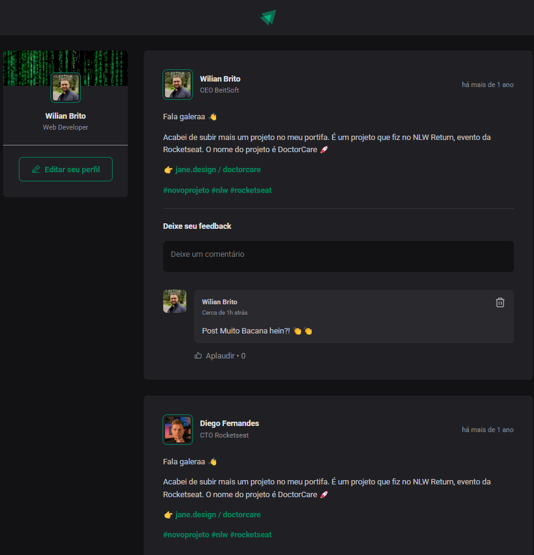

# Blog em React

# 📰 App Blog - Frontend em React

Este é o frontend de um blog desenvolvido com **React**. A aplicação permite aos usuários visualizar posts, deixar comentários e interagir com conteúdos publicados, simulando uma rede de compartilhamento de projetos e feedbacks técnicos.

---

## ✨ Funcionalidades

- Visualização de posts
- Campos para comentários com data e hora
- Interface responsiva e moder

---

## 🖼️ Tela do Projeto



> A imagem mostra um exemplo de post com comentários e interação entre usuários.

---

## 🚀 Tecnologias utilizadas

- React
- Vite
- TypeScript
- CSS Modules

---

## 📦 Como instalar e rodar

```bash
git clone https://github.com/Wilianbps/app-blog-frontend-react.git
cd app-blog-frontend-react
npm install
npm run dev
